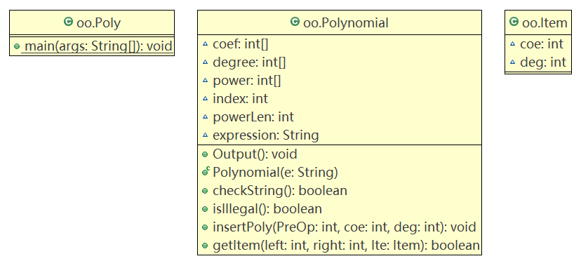
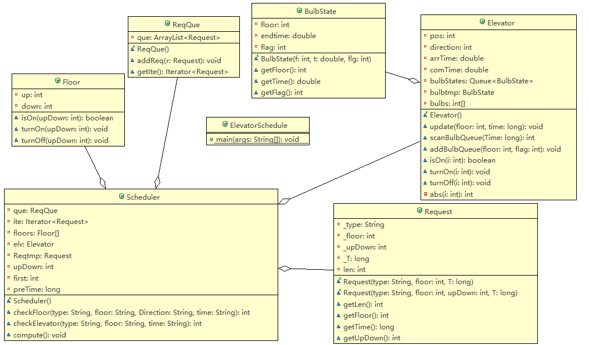
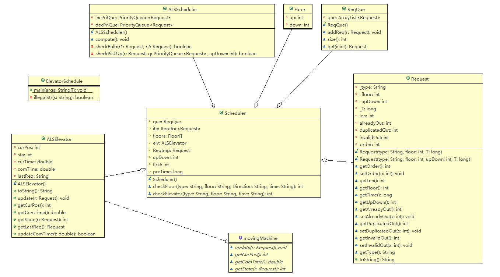

# 第一次博客作业

------

[TOC]

### **基于度量分析程序结构**


#### OO_1(多项式)

- Item类
  属性个数：2，方法个数：0，仅包含一个系数和一个次数，代码规模为3行
- Poly类
  属性个数：0，方法个数：1，仅包含一个main方法，代码规模为25行
- Polynomial类
  属性个数：6，方法个数：6。代码规模为166行

|     方法名     | 代码规模 | 控制分支数 |
| :---------: | :--: | :---: |
| Polynomial  |  3   |   0   |
| checkString |  50  |  10   |
|   getItem   |  50  |   9   |
| insertPoly  |  14  |   2   |
|  isIllegal  |  15  |   2   |
|   Output    |  25  |   3   |

- 调用关系
  Poly类在main方法中实例化一个Polynomial对象p，利用p的checkString方法和isIllegal方法检测输入字符串是否合法，然后将从字符串中提取出的数据插入多项式中，最后再用Output方法输出结果。
- 类图
  
- 优点：理解简单。
- 缺点：大部分工作集中在Polynomial类，其他类所承担的任务较少，分配不均衡，没有很好地体现面向对象的思想。

#### OO_2(傻瓜式电梯调度)

- BulbState
  属性数：3，方法数：4，代码规模为18行。

|    方法名    | 代码规模 | 控制分支数 |
| :-------: | :--: | :---: |
| BulbState |  5   |   0   |
|  getFlag  |  3   |   0   |
| getFloor  |  3   |   0   |
|  getTime  |  3   |   0   |

- Elevator
  属性数：7，方法数：8，代码规模为61行

|      方法名      | 代码规模 | 控制分支数 |
| :-----------: | :--: | :---: |
|   Elevator    |  5   |   0   |
|      abs      |  3   |   1   |
| addBulbQueue  |  4   |   0   |
|     isOn      |  3   |   0   |
| scanBulbQueue |  12  |   2   |
|    turnOff    |  3   |   0   |
|    turnOn     |  3   |   0   |
|    update     |  17  |   2   |

- ElevatorSchedule
  属性数：0，方法数：1，代码行数为40，仅有一个main方法
- Floor
  属性数：2，方法数：3，代码行数为17

|   方法名   | 代码规模 | 控制分支数 |
| :-----: | :--: | :---: |
|  isOn   |  4   |   1   |
| turnOff |  4   |   1   |
| turnOn  |  4   |   1   |

- ReqQue
  属性数：1，方法数：3，代码行数为12

|  方法名   | 代码规模 | 控制分支数 |
| :----: | :--: | :---: |
| ReqQue |  3   |   0   |
| addReq |  3   |   0   |
| getIte |  3   |   0   |

- Request
  属性数：5，方法数：6，代码行数为32

|    方法名     | 代码规模 | 控制分支数 |
| :--------: | :--: | :---: |
| Request(3) |  7   |   0   |
| Request(4) |  6   |   0   |
|  getFloor  |  3   |   0   |
|   getLen   |  3   |   0   |
|  getTime   |  3   |   0   |
| getUpDown  |  3   |   0   |

- Scheduler
  属性数：8，方法数：4，代码行数为94

|      方法名      | 代码规模 | 控制分支数 |
| :-----------: | :--: | :---: |
|   Scheduler   |  9   |   0   |
| checkElevator |  19  |   4   |
|  checkFloor   |  24  |   5   |
|    compute    |  30  |   8   |

- 调用关系
  ElevatorSchedule是主类，它接受字符串的输入，并利用构造的Scheduler对象sch检查字符串的合法性。sch在检查的同时将合法请求添加到请求队列。在输入结束之后sch开始用compute方法计算调度结果。在compute方法中，sche会调用除主类和BulbState类之外的其他类的对象。

- 类图

  

- 优点
  引入了BulbState概念，让Floor类和Elevator类拥有开关灯的方法，并利用这些方法剔除重复指令，使得程序设计更贴近现实。

- 缺点
  类之间的任务量分配不均衡，Elevator类除了接受Scheduler类的指令之外还要维护灯泡状态队列，即高内聚低耦合程度不够。

#### OO_3(ALS电梯调度)

- ALSElevator
  属性数：5，方法数：8，代码行数为66

|      方法名      | 代码规模 | 控制分支数 |
| :-----------: | :--: | :---: |
|  ALSElevator  |  4   |   0   |
|  getComTime   |  3   |   0   |
|   getCurPos   |  3   |   0   |
|  getLastReq   |  11  |   3   |
|   getState    |  10  |   3   |
|   toString    |  6   |   1   |
|    update     |  13  |   2   |
| updateComTime |  7   |   1   |

- ALSScheduler
  属性数：2，方法数：4，代码行数为96

|     方法名      | 代码规模 | 控制分支数 |
| :----------: | :--: | :---: |
| ALSScheduler |  19  |   0   |
|  checkBulb   |  9   |   3   |
| checkPickUp  |  32  |   3   |
|   compute    | 134  |  11   |

- ElevatorSchedule
  属性数：1，方法数：1，代码行数为65

|    方法名     | 代码规模 | 控制分支数 |
| :--------: | :--: | :---: |
| illegalStr |  19  |   2   |
|    main    |  46  |   5   |

- Floor
  属性数：2，方法数：0，代码行数为4
- movingMachine
  属性数：0，方法数：4，代码行数为6，其方法均为只有一行的抽象方法，靠ALSElevator实现。
- ReqQue
  属性数：1，方法数：4，代码行数为15

|  方法名   | 代码规模 | 控制分支数 |
| :----: | :--: | :---: |
| ReqQue |  3   |   0   |
| addReq |  3   |   0   |
|  size  |  3   |   0   |
|  get   |  3   |   0   |

- Request
  属性数：9，方法数：16，代码行数为50

|       方法名        | 代码规模 | 控制分支数 |
| :--------------: | :--: | :---: |
|    Request(4)    |  7   |   0   |
|    Request(3)    |  6   |   0   |
|  getAlreadyOut   |  3   |   0   |
| getDuplicatedOut |  3   |   0   |
|     getFloor     |  3   |   0   |
|  getInvalidOut   |  3   |   0   |
|      getLen      |  3   |   0   |
|     getOrder     |  3   |   0   |
|     getTime      |  3   |   0   |
|     getType      |  3   |   0   |
|    getUpDown     |  3   |   0   |
|  setAlreadyOut   |  3   |   0   |
| setDuplicatedOut |  3   |   0   |
|  setInvalidOut   |  3   |   0   |
|     setOrder     |  3   |   0   |
|     toString     |  5   |   1   |

- Scheduler
  属性数：8，方法数：3，代码行数为57

|      方法名      | 代码规模 | 控制分支数 |
| :-----------: | :--: | :---: |
|   Scheduler   |  2   |   0   |
| checkElevator |  19  |   4   |
|  checkFloor   |  25  |   5   |

- 调用关系
  主类ElevatorSchedule接收输入，并调用ALSScheduler类对象sch对输入格式进行检查，将检查合格的字符串构造成请求放入sch中的请求队列中。ALSScheduler类继承自Scheduler类，其中含有楼层类、请求类、请求队列类、实现了movingMachine接口的电梯类的各种对象。在得到合法的请求队列之后，ALSScheduler类调用自身的compute方法计算调度结果。

- 类图

  

- 优点
  采用了计算响应时间的方式判断是否捎带。所谓的响应时间指的是电梯到达请求指定楼层的时间。采取此方式避免了维护楼层完成时间的队列的复杂问题，简化了问题。

- 缺点
  同OO_2一样，还是存在调度类一家独大的问题。而且在此次设计中楼层类形同虚设，没有发挥任何作用。

### **Bug分析**

- 第一次作业：未发现Bug

- 第二次作业：未考虑+1的情况。这其实是一种容错能力不够的表现，此bug出现在ElevatorSchedule类的main方法中，原因是由于正则表达式无法匹配带有前导"+"的数字而认为其是错误请求。解决方法自然是修改正则表达式使得它能识别带前导"+"和不带前导"+"的正数。

- 第三次作业：

  Bug1:输入                                                                                                                   输出

  ```java
  (FR,1,UP,0)                                                    [FR,1,UP,0]/(1,STILL,1.0)
  (FR,7,UP,1)                                                    [FR,5,UP,2]/(5,UP,3.0)
  (FR,5,UP,2) 											   SAME [FR,5,UP,3]
  (FR,5,UP,3)	                                                   [ER,6,5]/(6,UP,4.5)
  (FR,8,UP,3)                                                    [FR,7,UP,1]/(7,UP,6.0)
  (ER,6,5)                                                       [FR,8,UP,3]/(8,UP,7.5)
  (ER,9,6)                                                       [ER,9,6]/(9,UP,9.0)
  q
  ```

  原因分析：[ER,6,5]/(6,UP,4.5)显然错误，原因是在每次判断电梯经停楼层的时候，没有剔除重复楼层的影响，而重复楼层只会开一次门。因此错误地计算了电梯抵达6层的时间，实际上电梯在4.5秒就能抵达6层，故将(ER,6,5)指令认为是可捎带的。在用一个数组保存每次经停的楼层，并检查是否存在重复楼层之后，问题解决。

  Bug2:输入                                                                                                   输入

  ```java
  (FR,1,UP,0)                                                [FR,1,UP,0]/(1,STILL,1.0)
  (FR, 2, UP, 1)                                             [FR,2,UP,1]/(2,UP,1.5)
  (FR, 4, UP, 2)                                             [FR,4,UP,2]/(4,UP,3.5)
  (FR, 1, UP, 3)                                             [FR,1,UP,3]/(1,DOWN,6.0)
  (FR, 3, UP, 3)                                             SAME [FR,1,UP,7]
  (FR, 8, UP, 3)                                             [FR,2,UP,4]/(2,UP,7.5)
  (FR, 5, UP, 3)                                             [ER,2,6]/(2,UP,7.5)
  (FR, 2, UP, 4)                                             [FR,3,UP,3]/(3,UP,9.0)
  (FR, 7, DOWN, 5)                                           [ER,5,5]/(5,UP,11.0)
  (ER, 5, 5)                                                 SAME [ER,5,7]
  (ER, 10, 6)                                                SAME [ER,5,7]
  (ER, 2, 6)                                                 [FR,6,UP,7]/(6,UP,12.5)
  (FR, 6, UP, 7)                                             [ER,6,8]/(6,UP,12.5)
  (ER, 5, 7)                                                 [FR,8,UP,3]/(8,UP,14.5)
  (FR, 1, UP, 7)                                             [ER,10,6]/(10,UP,16.5)
  (ER, 5, 7)                                                 [FR,7,DOWN,5]/(7,DOWN,19.0)
  (ER, 6, 8)                                                 [FR,5,UP,3]/(5,DOWN,21.0)
  q
  ```

  原因分析：遍历时忽略了(FR,5,UP,3)的可捎带请求。这是因为在新的指令升级成主请求之后，程序虽然有从前往后扫描请求队列找到能继续插入队列中的请求，但是没有考虑到队列中存在楼层重复的请求的问题，因此忽略了(FR,5,UP,3)指令，导致其在最后才执行。修改方法是在从前往后扫描队列的过程中加入对楼层重复请求的判断。

  Bug3:Readme文档考虑不充分导致错误。由于在Readme文档中规定了不论指令是否合法，超过100000条立即截止。但是在实际程序中却是当不含非法字符指令超过100000条才截止，含有非法字符的指令直接被忽略了。因此修改方式是在每次输入的一开始让计数器加一。

### **Bug探测策略**

  主要方法是结合自己在编写代码的过程中积累的测试样例，从边界情况考察被测者代码的正确性。在考察的同时应结合被测者相关代码进行测试。

- 第一次作业：

```java
    if (s[i] == '-') {opx = -1; i++;}
    else if (s[i] == '+') {opx = 1; i++;}
    do
    {...
    }while (s[i] != ',');
    i++;
    if (s[i] == '-') {opy = -1; i++;}
    else if (s[i] == '+') {opy = 1; i++;}
    do
    {...
    }while (s[i] != ')');	
    tmp.append(op*x*opx,y*opy);
    i++;
    if (s[i] == ',') i++;
    sb++;
    if (sb > 50)
    {...
    }
    }while (s[i] != '}');
```

  从被测者提取数对的过程中可以看出，假如输入的字符串为"{(1,1),}"，则在代码进行到"if (s[i]==',') i++;"时，条件满足且s[i]='}'，则跳出循环，数对被添加到多项式中，这显然没有对错误的输入进行报错处理，而是将错误输入当做了正确输入。因此找到了这一个不报错的bug。

- 第二次作业：

```java
Pattern pattern0 = Pattern.compile("\\(FR,(0?[1-9]|10),(UP|DOWN),\\d{1,9}\\)");
Matcher matcher0 = pattern0.matcher(str);
				
Pattern pattern1 = Pattern.compile("\\(ER,(0?[1-9]|10),\\d{1,9}\\)");
Matcher matcher1 = pattern1.matcher(str);
```

  这是被测者的正则表达式，从中可以很清楚地看到被测者没有支持前导"+"，而且被测者将时间数据限制为最多只有9位数，则无法满足readme所给的建议数据范围要求。

- 第三次作业

```java
public void merge(request req,float f)
	{
		int j=0;
		for(;j<reqlist.size();j++)
		{
			if(reqlist.get(j).target()==req.target() && reqlist.get(j).ID()==req.ID() &&
				reqlist.get(j).direction().equals(req.direction())&& reqlist.get(j).time()<=f)
			{
				if(reqlist.get(j).time()!=req.time())
					log.writeln("SAME"+reqlist.get(j).toString());
				reqlist.remove(j);
				j--;
			}
		}
	}
```

&emsp;&emsp;这是被测者对于重复指令的处理函数，从中可以看出，被测者虽然有重复指令报错的意识，但是在往log里面写入SAME提示信息的时候，却加了一个前提：reqlist.get(j).time()!=req.time()。因此在两条甚至多条完全相同的指令的时候，该程序只会输出一个结果，并且不会提示SAME，因为完全相同的指令的产生时间一定也相同。这也就是被测者未通过公共测试样例18的原因。

### **心得体会**

  在前三次作业中，我感受最深的是一个良好的设计往往是整个工程最关键的部分。因为作业之间不是相互独立的，而是某次的作业可能是下一次作业的基础。如果设计的可扩展性不强，正如我第二次的程序，那么下次作业则需要修改大量的代码，甚至将原有的设计推翻重写。这样带来的损失是巨大的，而且有前车之鉴，比如计算机组成原理的课程设计。
  而前三次作业暴露出的另一个问题则是对面向对象思想的不熟练，很多时候还是用的曾经的面向过程的思想。这也是导致代码量分布不均、高内聚低耦合程度不够、有时候一个类掌管了几乎所有的重要方法和属性的原因。拆开class {}，很多同学包括我的代码实际上就是一个巨大的面向过程程序。
  此外，相信很多同学也有感触的是每次作业其实并不难，难的是如何保持程序的健壮性。因为用户可能提供各种各样的输入，如何保持程序正确处理这些输入并计算出正确结果，是OO这门课很大的一个考察点。


